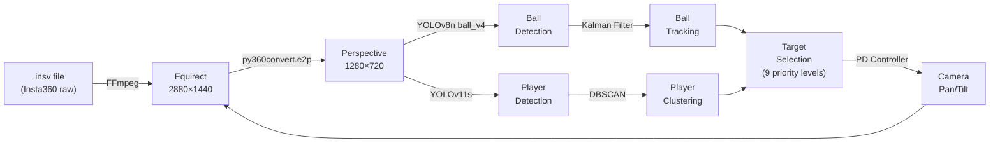

# Ball Tracking Solution — Implementation Plan

## Current State Assessment

The **insta360_analysis** repo is a football video analysis platform for ASN Pfeil Phönix Nürnberg. It processes Insta360 360° footage into autopanned game videos. The repo has evolved through 3 generations:

| Generation | File | Key Feature |
|---|---|---|
| v1 | [autopan.py](file:///c:/Workspace/2026/David-Ball-Tracking/insta360_analysis/src/autopan/autopan/autopan.py) | Player centroid tracking only |
| v2 | [autopan_v2.py](file:///c:/Workspace/2026/David-Ball-Tracking/insta360_analysis/src/autopan%202/autopan/autopan_v2.py) | Ball detection + MLP prediction |
| v3 (current) | [autopan_infer.py](file:///c:/Workspace/2026/David-Ball-Tracking/insta360_analysis/autopan_infer.py) | Kalman tracker, DBSCAN clustering, PD control, reanchor |
| v5 (modular) | [src/autopan/](file:///c:/Workspace/2026/David-Ball-Tracking/insta360_analysis/src/autopan/) | Team clustering, two-pass detection, IoU tracking (**has syntax bug**) |

> [!IMPORTANT]
> **Two parallel codebases exist.** The monolithic [autopan_infer.py](file:///c:/Workspace/2026/David-Ball-Tracking/insta360_analysis/autopan_infer.py) is the evaluated/production version. The modular [src/autopan/](file:///c:/Workspace/2026/David-Ball-Tracking/insta360_analysis/src/autopan/) package is a cleaner refactor with valuable features (team colour clustering via HSV/LAB k-means, two-pass tiled detection, IoU-based tracking) but contains a **syntax error** in [autopan_v5_refactor.py](file:///c:/Workspace/2026/David-Ball-Tracking/insta360_analysis/src/autopan/autopan/autopan_v5_refactor.py) (missing comma in TrackManager constructor) making it non-executable. The [src/autopan 2/](file:///c:/Workspace/2026/David-Ball-Tracking/insta360_analysis/src/autopan%202/) copy does NOT have this bug.

### Current Pipeline



### Current Evaluation Results

| Approach | Clip 001 | Clip 002 | Clip 003 | Clip 004 | Clip 005 | **Mean RMSE** |
|---|---|---|---|---|---|---|
| **Track** (continuous) | 48.1° | 58.1° | 44.0° | 16.5° | 73.2° | **47.9°** |
| **Reanchor** (triggered) | 38.5° | 47.0° | 30.1° | 16.5° | 33.1° | **33.0°** |

> [!WARNING]
> Even 16° RMSE (best case) shifts the action centre by ~30% of frame width. The current system frequently points at the wrong area of the pitch entirely (50-70° errors = looking at wrong goal).

---

## Root Cause Analysis — 7 Critical Bottlenecks

### 1. Ball Detector Quality (Impact: ★★★★★)

The ball detection model is the single largest bottleneck:

- **Dataset**: Only **850 source images** (2550 with augmentations) from Roboflow, trained at 640×640
- **Model**: YOLOv8-nano — the smallest YOLO variant, optimised for speed not accuracy
- **Ball appearance**: ~10-15 pixels in the 1280×720 perspective view
- **mAP50**: 0.784 (reported in commit messages) — ~22% of balls are missed even at IoU=0.50
- **Confidence**: Detection runs at `CONF_BALL=0.40`, producing many false positives
- **Spatial gating**: False positives are partially filtered by pitch mask + Kalman proximity, but this is fragile

### 2. Single-View Detection (Impact: ★★★★☆)

Detection only runs on the **current perspective view** (1280×720 at the current pan angle). If the ball is outside this view, it's invisible to the system. This creates a chicken-and-egg problem:
- Camera needs to see the ball to follow it
- Camera needs to already be pointing at the ball to detect it

### 3. Temporal Undersampling (Impact: ★★★★☆)

Detection runs every **5 frames** (6 fps at 30fps video). A ball kicked at 100 km/h moves ~46 cm per detection window. In pixel space this is ~50-100 pixels — enough to trigger the Kalman teleport rejection and lose tracking entirely.

### 4. Kalman Model Mismatch (Impact: ★★★☆☆)

The constant-velocity Kalman filter assumes the ball moves in a straight line. Football physics involve:
- Parabolic trajectory (gravity)
- Sudden acceleration changes (kicks, headers, bounces)
- Spin effects

The velocity decay (0.92^n) is a workaround that causes predictions to "die" after ~15 frames.

### 5. No Team Awareness (Impact: ★★★☆☆)

The system can't distinguish teams. When the ball changes possession across the pitch, the camera has no signal to predict direction. Human operators anticipate passes from context — the algorithm can't.

### 6. Pitch Mask Rigidity (Impact: ★★☆☆☆)

The pitch mask is rebuilt only every 25 frames and uses a 40-pixel erosion that clips near-boundary detections. Aerial balls are handled by opening the top third, but this introduces sky-region false positives.

### 7. Mac-Only Pipeline (Impact: ★★☆☆☆)

The pipeline uses `h264_videotoolbox` (macOS encoder), `/Volumes/` for SD card detection, and paths hardcoded to macOS conventions. This prevents running on the Windows dev machine or a cloud GPU.

---

## Hardware Constraints — Insta360

| Parameter | Value | Impact |
|---|---|---|
| **Resolution** | 5.7K (5760×2880 combined) per lens | Good raw quality |
| **Effective equirect** | 2880×1440 (single lens) | Ball is tiny in wide view |
| **FOV** | ~200° per lens (fisheye) | Full pitch visible but heavily distorted |
| **Frame rate** | 30 fps | Adequate but ball moves fast |
| **Lens count** | 2 (front/back) | Only one lens faces the pitch |
| **Mounting** | Stationary on sideline | Fixed position, no PTZ |
| **Bitrate** | ~120 Mbps (H.265) | Compression artefacts on small objects |

> [!IMPORTANT]
> The fundamental challenge: the ball subtends only **~10-15 pixels** in the perspective view, and even fewer (~5-8 px) in the full equirectangular frame. This is near the limit of what YOLO-family detectors can reliably detect.

---

## Proposed Improvement Plan

### Phase 0: Codebase Consolidation & Cross-Platform (2-3 days)

> [!TIP]
> Essential prerequisite — merge the best features from both codebases and make everything runnable on Windows.

#### [MODIFY] [autopan_infer.py](file:///c:/Workspace/2026/David-Ball-Tracking/insta360_analysis/autopan_infer.py)
- Replace `h264_videotoolbox` with `libx264` (cross-platform) and add NVENC auto-detection for GPU encoding
- Fix the `tracker.reset()` call (L426) — the inline `KalmanBallTracker` has no `reset()` method
- Add `--device cuda` support alongside `mps`

#### [NEW] Merge valuable v5 modules into main pipeline
- **Team colour clustering** from [team_cluster.py](file:///c:/Workspace/2026/David-Ball-Tracking/insta360_analysis/src/autopan/autopan/team_cluster.py) — HSV/LAB k-means with bootstrap phase (250 frames), grass masking, online centroid adaptation. This is production-ready code.
- **Two-pass tiled detection** from [perception.py](file:///c:/Workspace/2026/David-Ball-Tracking/insta360_analysis/src/autopan/autopan/perception.py) — first pass at 960px, optional second pass with 1280px tiles on far band. Improves detection of distant players.
- **IoU-based tracking** from [tracking.py](file:///c:/Workspace/2026/David-Ball-Tracking/insta360_analysis/src/autopan/autopan/tracking.py) — greedy IoU matching with label history for stable team assignments.
- **Field optimiser** from [field_opt.py](file:///c:/Workspace/2026/David-Ball-Tracking/insta360_analysis/src/autopan/autopan/field_opt.py) — grid-search yaw/pitch when pitch coverage drops below 18%.

#### [MODIFY] [worker_server.py](file:///c:/Workspace/2026/David-Ball-Tracking/insta360_analysis/worker_server.py)
- Add Windows volume/drive detection alongside macOS `/Volumes/`

#### [MODIFY] [evaluate.py](file:///c:/Workspace/2026/David-Ball-Tracking/insta360_analysis/evaluate.py)
- Make clip paths configurable instead of hardcoded macOS paths
- Add `--clips-file` flag to load from JSON

---


### Phase 1: Ball Detector Upgrade (Highest Impact, 1-2 weeks)

> [!TIP]
> Expected impact: reduce ball detection miss rate from ~22% to <10%, which cascades into dramatically better tracking.

#### [MODIFY] Ball detector training pipeline

**A. Dataset expansion (4x–10x)**
- Extract 3000+ frames from the existing `.insv` footage using [extract_frames.py](file:///c:/Workspace/2026/David-Ball-Tracking/insta360_analysis/extract_frames.py) at diverse timestamps, pan angles, and lighting conditions
- Use the existing `.insprj` ground truth to extract frames at known ball-visible moments
- Annotate using Roboflow with active learning: train on current data, predict on new frames, human-correct predictions
- Target: 3000-5000 annotated frames (4-6x current)

**B. Model upgrade (YOLOv8n → YOLOv8s or YOLO11s)**
- Switch from nano to small variant: ~3x more parameters, ~2x better mAP on small objects
- Train at **1280×1280** (matching inference size) instead of 640×640
- Add specific small-object augmentations: mosaic, copy-paste, aggressive scale jitter (0.3-2.0x)

**C. Inference improvements**
- Implement **SAHI** (Slicing Aided Hyper Inference) — run detection on overlapping 640×640 tiles of the 1280×720 frame, merge results with NMS
- This effectively gives 2-4x better resolution for small object detection without changing the model

#### [NEW] `train_ball_v5.py`
- Automated training script with proper train/val/test splits from the full annotation pool
- Wandb/MLflow logging for experiment tracking
- Hyperparameter sweep: confidence threshold, NMS IoU, augmentation strategy

---

### Phase 2: Multi-Scale Equirectangular Detection (1-2 weeks)

> [!TIP]
> Expected impact: eliminate the "can't find ball outside current view" problem entirely.

#### [NEW] `equirect_ball_scanner.py`

Instead of detecting the ball only in the current 1280×720 perspective view, scan the **full equirectangular frame** at multiple angles:

```
Scan pattern: 7 overlapping perspectives covering the pitch polygon
  pan = [-45, -30, -15, 0, +15, +30, +45]
  each at calibrated tilt, output 960×540

  Total: 7 × SAHI inference → merge all detections in equirect coordinates
```

**Implementation**:
1. Every N frames (e.g., every 10-15 frames), run full-pitch scan
2. Convert all detections to equirectangular (lon, lat) coordinates
3. Feed strongest detection to Kalman filter in equirect space
4. Between scans, run fast single-view detection on current perspective

**Trade-off**: 7x more inference per scan frame, but scans are less frequent. Net cost ~2-3x current, acceptable on GPU.

#### [MODIFY] [autopan_infer.py](file:///c:/Workspace/2026/David-Ball-Tracking/insta360_analysis/autopan_infer.py)
- Move Kalman filter from perspective-pixel space to equirectangular-degree space
- This decouples ball tracking from camera position — tracking persists across pan changes
- Convert camera target from equirect degrees to perspective pixels for PD control

---

### Phase 3: Temporal Tracking Upgrades (1 week)

#### [MODIFY] Kalman filter → IMM (Interacting Multiple Model) filter

Replace the single constant-velocity Kalman with a 3-model IMM filter:

| Model | State | Use Case |
|---|---|---|
| **Stationary** | [x, y] | Ball at rest, throw-ins, free kicks |
| **Constant Velocity** | [x, y, vx, vy] | Ball rolling, slow passes |
| **Constant Acceleration** | [x, y, vx, vy, ax, ay] | Long passes, shots, aerial balls |

The IMM automatically blends model probabilities — it adapts to sudden velocity changes (kicks) much better than single-model Kalman.

#### [MODIFY] Detection frequency
- Increase from every 5 frames to every **2 frames** for ball detection (every 3 for players)
- Optimise by running ball detection at 640×640 on every 2nd frame and 1280×1280 on every 6th

#### [NEW] `ball_tracker_equirect.py`
- Standalone ball tracker operating in equirectangular coordinates
- Persistent tracking across camera movements
- Multi-hypothesis tracking: maintain top-3 ball candidates to handle temporary confusion

---

### Phase 4: Pitch-Aware Intelligence (1-2 weeks)

#### [NEW] Homography-based pitch model

Use the calibrated pitch polygon to compute a **homography** mapping perspective pixels → pitch coordinates (metres):

```
Benefits:
- Filter detections by physical plausibility (ball speed < 150 km/h)
- Predict ball trajectory in metres, not pixels (physics-based)
- Detect events: goal kicks (ball near goal), corners, throw-ins
- Team formation analysis for smarter pan prediction
```

#### [MODIFY] Target selection with game-state awareness
- If ball is lost, predict likely location based on:
  - Last known velocity and position (in pitch metres)
  - Player formation shift direction
  - Game state heuristics (e.g., after a shot, look at the goal area)

#### [NEW] `team_classifier.py`
- Fine-tune a classification head on top of YOLO person detections
- Cluster by jersey colour in HSV space (simple but effective for amateur football with distinct kits)
- Enables: possession detection, formation analysis, direction-of-play prediction

---

### Phase 5: Integration & End-to-End Pipeline (1 week)

#### [MODIFY] [autopan_infer.py](file:///c:/Workspace/2026/David-Ball-Tracking/insta360_analysis/autopan_infer.py)
- Integrate all components into the main pipeline
- Replace `h264_videotoolbox` with cross-platform encoder (`libx264` or NVENC)
- Add `--device cuda` support for Windows/Linux GPU acceleration

#### [MODIFY] [evaluate.py](file:///c:/Workspace/2026/David-Ball-Tracking/insta360_analysis/evaluate.py)
- Expand clip registry beyond the current 5 clips
- Add per-frame ball-tracking metrics (not just pan RMSE):
  - Ball detection recall (% of frames where ball is correctly localised)
  - Ball tracking continuity (longest unbroken track in seconds)
  - Ball position RMSE (in metres on pitch)
  - Switching latency (frames until camera follows a long pass)

#### [MODIFY] [worker_server.py](file:///c:/Workspace/2026/David-Ball-Tracking/insta360_analysis/worker_server.py)
- Add Windows SD card detection alongside macOS `/Volumes/`
- Add endpoint to trigger autopan pipeline from web UI
- Add progress reporting via WebSocket for long-running autopan jobs

#### [MODIFY] Web app calibrate page
- Integrate autopan trigger button after calibration
- Show live progress/preview during autopan processing

---

## Verification Plan

### Automated Tests
```bash
# Phase 1: Ball detector evaluation
python train_ball_v5.py --eval-only --weights models/ball_v5.pt
# Target: mAP50 > 0.90 (up from 0.784), mAP50-95 > 0.60

# Phase 2: Full-pitch ball recovery test
python equirect_ball_scanner.py --insv test_clip.insv --calib calibration/pitch.json
# Target: detect ball in >80% of frames where ball is on pitch

# Phase 3+4: End-to-end evaluation
python evaluate.py --approach track_v2 --clips 001,002,003,004,005
# Target: Mean RMSE < 15° (down from 33° reanchor / 48° track)

# Per-frame ball tracking metrics
python evaluate.py --approach track_v2 --ball-metrics
# Target: Ball detection recall > 70%, track continuity > 5s median
```

### Manual Verification
- Visual review of output videos for each evaluation clip
- Side-by-side comparison with Insta360 Studio ground truth rendering
- Test on footage from different dates/venues (May 2025, June 2025, July 2025 clips)

---

## Open Questions

> [!IMPORTANT]
> **Q1: Development platform** — Are you developing on the Windows machine or the Mac Mini mentioned in the README? This determines GPU availability (CUDA vs MPS) and which platform to prioritise.

> [!IMPORTANT]
> **Q2: Ball annotation budget** — How much time can you/the team spend on annotating new ball training data? Expanding from 850 → 3000+ images is the single highest-impact improvement, but requires human labeling time.

> [!IMPORTANT]
> **Q3: Processing speed requirements** — Is real-time processing needed, or is offline batch processing acceptable? Real-time constrains model size; offline allows much heavier models for better accuracy.

> [!IMPORTANT]
> **Q4: Available GPU hardware** — What GPU is available? This determines whether SAHI and multi-view scanning are feasible (they multiply inference cost 3-7x).

> [!IMPORTANT]
> **Q5: Which video files are accessible?** — The evaluation clips reference `/Volumes/Sickis disk/` (external drive). Are these `.insv` files available on the current machine, or do we need to work with whatever footage is locally available?

> [!IMPORTANT]
> **Q6: Priority — ball tracking vs. overall pan quality?** — Should we focus purely on ball detection/tracking improvements, or also on the pan control system (PD controller, target selection logic, reanchor strategy)?

---

## Expected Impact Summary

| Phase | Current → Target | Metric |
|---|---|---|
| **Phase 1** (detector) | mAP50 0.784 → 0.90+ | Ball detection accuracy |
| **Phase 2** (multi-view) | 0% → 80%+ | Ball found when outside current view |
| **Phase 3** (tracking) | ~1.5s max prediction → ~4s | Tracking through occlusion |
| **Phase 4** (pitch model) | Rule-based → physics-based | Target prediction quality |
| **Overall** | 33° mean RMSE → <15° | Pan accuracy vs ground truth |
